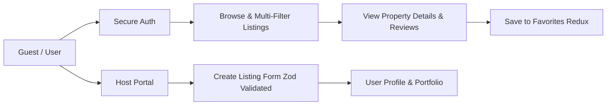
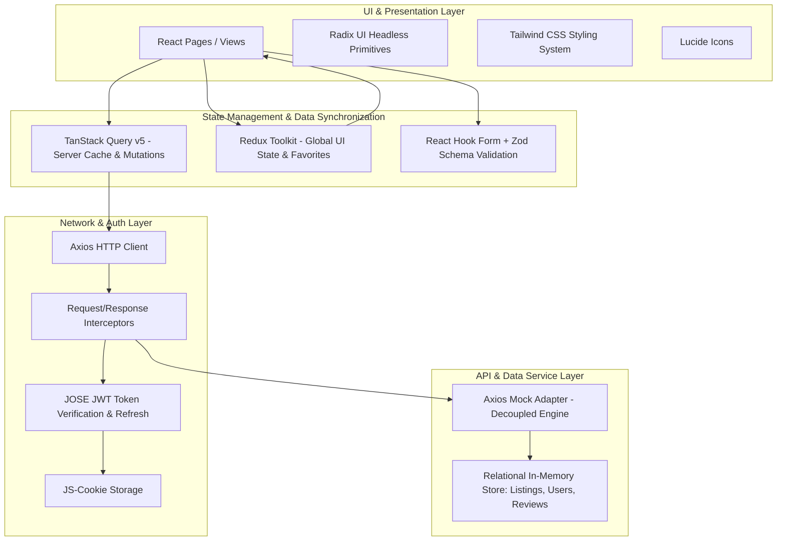

# 🏡 StayHub — Enterprise Vacation Rental & Property Booking Platform

[](https://react.dev/)
[](https://vitejs.dev/)
[](https://redux-toolkit.js.org/)
[](https://tanstack.com/query)
[](https://tailwindcss.com/)
[](https://www.radix-ui.com/)
[](https://zod.dev/)
[](https://www.cypress.io/)

---

## 📋 Table of Contents
1. [Project Overview](#-project-overview)
2. [Key Features & User Workflows](#-key-features--user-workflows)
3. [System Architecture](#-system-architecture)
4. [Tech Stack & Purpose Matrix](#-tech-stack--purpose-matrix)
5. [Key Technical Challenges & Solutions](#-key-technical-challenges--solutions)
6. [Future Roadmap & Enhancements](#-future-roadmap--enhancements)
7. [Getting Started & Local Setup](#-getting-started--local-setup)
8. [Engineering Standards & Best Practices](#-engineering-standards--best-practices)

---

## 🌟 Project Overview

**StayHub** is a high-performance, responsive property booking and vacation rental web application designed to match the enterprise standards of modern rental platforms.

The application provides a seamless marketplace experience for **Guests** (searching, filtering, inspecting listings, favoriting properties, reading verified reviews) and **Hosts** (listing creation, availability date-range management, pricing setup, profile & portfolio tracking).

### Core Highlights
- **Instant Client-Side Caching & Navigation:** Sub-second page loads with zero-latency interactions powered by TanStack Query and Redux Toolkit.
- **Security & Session Continuity:** Automated silent JWT refresh cycle mitigating session drop-offs and expired tokens.
- **Decoupled Architecture:** Clean API abstraction layer allowing the frontend to connect to any RESTful or GraphQL backend seamlessly.

---

## 🚀 Key Features & User Workflows



### 1. Dynamic Discovery & Multi-Parameter Search
- **Instant Search:** Full-text filtering across listing names, locations, and descriptions.
- **Guest Capacity Stepper:** Interactive counter to filter rentals by minimum guest requirements.
- **Date Range Picker:** Real-time calendar availability filtering powered by `date-fns` and `react-day-picker`.
- **Empty-State Handling:** Elegant fallbacks and suggestions when search parameters return zero matches.

### 2. Rich Property Details & Social Proof
- **Visual Image Carousels:** Smooth touch-and-swipe property imagery using `embla-carousel-react`.
- **Ratings & Reviews Breakdown:** Dynamic star calculation and verified guest testimonial feeds.
- **Host Information Card:** Direct attribution to host profiles, bios, and credibility badges.

### 3. Robust Authentication & Session Resilience
- **JWT Auth Flow:** Access tokens (short-lived) + Refresh tokens (long-lived in cookies).
- **Silent Axios Interceptors:** Automated 403 interception and seamless token refresh without disrupting user actions.
- **Protected Routing:** Route guards enforcing authentication policies on private pages.

### 4. Host Management & Property Publishing
- **Zod-Powered Validation:** Strict type-safe form verification with instant inline error handling.
- **Multi-Field Form Engine:** Name, description, location dropdown, dynamic image URL arrays, nightly pricing, guest caps, and availability calendars.

### 5. Instant Wishlisting (Favorites)
- **Global Redux Store:** Optimistic wishlist toggling across listings with instant UI reflection across navigation items and dedicated `/favorites` screen.

---

## 🏗️ System Architecture



---

## 💻 Tech Stack & Purpose Matrix

| Technology | Category | Why It Was Chosen / Specific Purpose |
| :--- | :--- | :--- |
| **React 18.3** | Core Framework | Declarative component model, Concurrent features, hooks-driven state, and large ecosystem for scalable SPAs. |
| **Vite 5.2** | Build Tool & Bundler | Ultra-fast Hot Module Replacement (HMR), rapid ES-module based dev server, and optimized production tree-shaking. |
| **TanStack Query v5** | Server State & Data Sync | Handles caching, background refetching, loading/error states, deduplication of network requests, and query invalidation. |
| **Redux Toolkit 2.0** | Global Client State | Manages application-wide synchronous state (user session metadata, favorite listing collections) with immutable updates. |
| **React Router Dom 6.17** | Client-Side Routing | Provides declarative nested routes, dynamic URL parameters (`/listings/:listingId`), and protected route wrappers. |
| **Tailwind CSS 3.3** | Styling & UI System | Utility-first styling enabling bespoke, responsive designs with zero CSS bloat and seamless dark/light theme integration. |
| **Radix UI** | Headless UI Components | Accessible, unstyled primitives (Dialogs, Dropdowns, Popovers, Selects, Menubars) ensuring full WCAG compliance and keyboard navigation. |
| **React Hook Form** | Form Engine | High-performance, un-controlled form inputs minimizing re-renders during high-frequency user typing. |
| **Zod 3.22** | Schema Validation | Declarative, TypeScript-friendly schema validation with runtime checks and localized error messaging. |
| **Axios & Mock Adapter** | Networking & Mocking | Clean HTTP client with interceptor support. Mock adapter decouples frontend development from backend delivery timelines. |
| **JOSE & JS-Cookie** | Security & Session | Client-side JWT generation/verification simulating true microservices authentication with refresh token cookies. |
| **Embla Carousel React** | Media Presentation | Touch-friendly, performant image carousel for immersive listing galleries. |
| **Date-fns & DayPicker** | Date Operations | Lightweight, modular date calculations and intuitive calendar range picker for booking availability. |
| **Cypress 13.15** | End-to-End Testing | Automated browser testing validating user authentication, search/filtering flows, and zero-result UI states. |
| **ESLint & Prettier** | Code Quality | Enforces consistent code style, clean imports, and zero unused dependencies across the team. |

---

## 🛠️ Key Technical Challenges & Solutions

### Challenge 1: Silent JWT Token Refresh Without Race Conditions
- **Problem:** When an access token expires while multiple parallel queries are executing, multiple simultaneous 403 errors occur. Without proper synchronization, this causes multiple refresh requests, race conditions, and user session termination.
- **Solution:** Configured an Axios response interceptor with a retry queue and `_retry` flag check. When a 403 Unauthorized is caught, the app calls `/api/refreshToken`, retrieves a new access token, updates the `Authorization` header, and seamlessly replays the original requests transparently to the user.

### Challenge 2: Eliminating Cache Stagnation & Server-State Clutter
- **Problem:** Storing remote API data in Redux causes stale data, manual boilerplate reducers, and synchronicity issues between the frontend and database.
- **Solution:** Architectural segregation:
  - **Server State:** Delegated exclusively to **TanStack Query** (caching, garbage collection, query key invalidation on mutation).
  - **Client State:** Delegated exclusively to **Redux Toolkit** (active user identity, favorite listings array).

### Challenge 3: Complex Multi-Criteria Filtering with Instant Feedback
- **Problem:** Filtering listings by text search, minimum guest capacity, and date-range overlaps simultaneously can cause laggy UI re-renders and synchronization bugs.
- **Solution:** Implemented controlled filter state hoisted to the parent page with memoized handlers (`useCallback`) and TanStack Query dependency arrays. Any change in search criteria triggers a debounced query fetch with server-side/mock filtering logic.

### Challenge 4: Type-Safe Dynamic Form Validation for Property Listings
- **Problem:** Property creation requires heterogeneous inputs: strings, numbers, image arrays, date ranges, and select boxes. Manual validation creates messy code and edge-case validation misses.
- **Solution:** Integrated **Zod** schema validation connected to **React Hook Form** via `@hookform/resolvers/zod`. This guarantees complete runtime validation before submission, automatically formatting coerced numbers and dates.

### Challenge 5: Decoupled Development & Backend Readiness
- **Problem:** Waiting for the backend API team can stall frontend progress and slow development velocity.
- **Solution:** Engineered an Axios Mock Adapter layer mirroring real-world REST endpoints (`/api/listings`, `/api/signin`, `/api/me`, `/api/reviews`, `/api/refreshToken`) with realistic latency simulation. The frontend is **100% production-ready**: changing `VITE_BASE_URL` instantly connects it to a live production backend.

---

## 🔮 Future Roadmap & Enhancements

1. **Interactive Map Integration:** Mapbox / Google Maps integration with geo-clustering and boundary search.
2. **Payment Gateway Integration:** Stripe Connect for split payouts between platform and hosts.
3. **Real-time Messaging:** WebSockets/Socket.io guest-host messaging and push notifications.
4. **AI-Powered Recommendations:** Smart pricing suggestions for hosts and personalized recommendations for guests.
5. **Multi-Language & Multi-Currency (i18n):** Global localization for international booking operations.

---

## ⚙️ Getting Started & Local Setup

### Prerequisites
- Node.js (v18.0.0 or higher recommended)
- npm or yarn

### Installation
```sh
# 1. Clone or navigate into the repository
cd project-react-final-code

# 2. Install dependencies
npm install

# 3. Launch the development server
npm run dev
```
Open your browser and navigate to `http://localhost:5173`.

### 🔑 Demo Login Credentials
- **Email:** `demo@cosdensolutions.io`
- **Password:** `cosdensolutions`

### Quality & Testing Commands
```sh
# Run code formatter and linter
npm run fix

# Run Cypress End-to-End Tests
npm run cy:open

# Build optimized production bundle
npm run build
```

---

## 👨‍💻 Engineering Standards & Best Practices
- **Strict ESLint & Prettier Rules** for clean, readable code.
- **Component-Driven Architecture** with atomic UI components.
- **Custom Hooks** for queries (`useListingsQuery`, `useListingDetailsQuery`) and mutations (`useCreateListingMutation`).
- **Secure Storage Guidelines** ready for production `HttpOnly` cookie migration.

---
*Built with ❤️ for enterprise-grade scalability and exceptional user experiences.*
